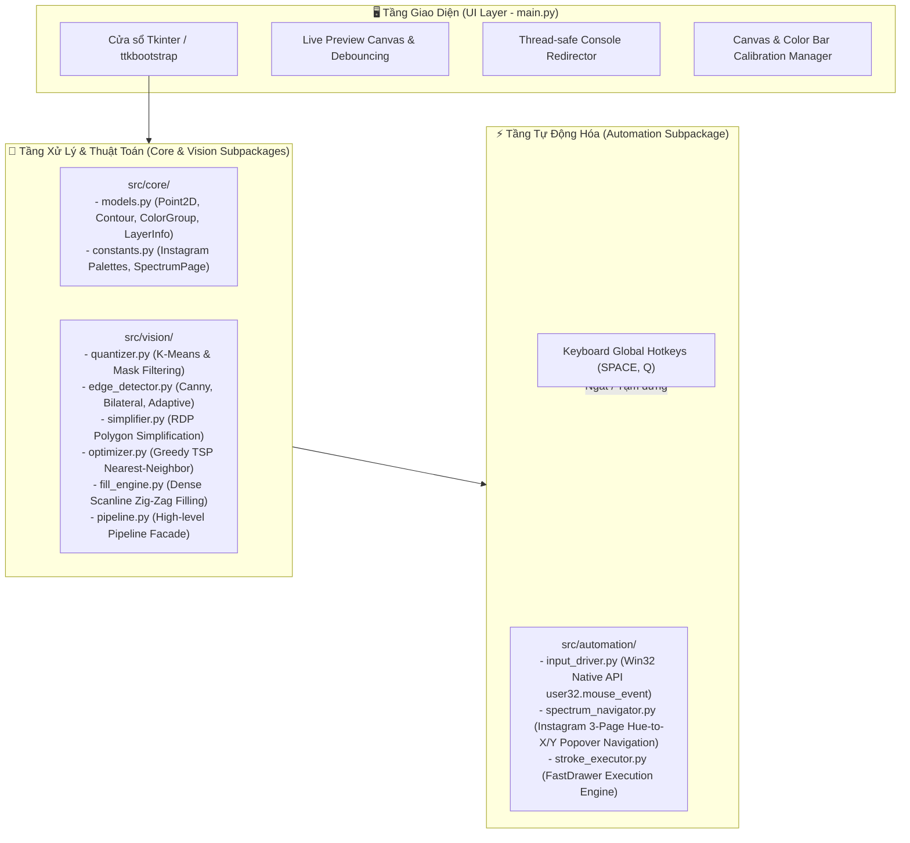
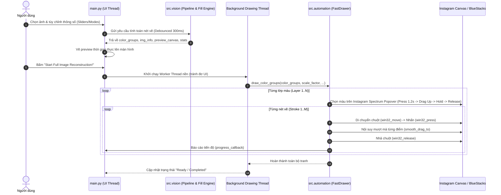

# 🏗️ Kiến Trúc Hệ Thống AutoDoodle Pro (System Architecture)

Tài liệu này mô tả chi tiết kiến trúc tổng thể, mô hình luồng dữ liệu, hệ tọa độ chuẩn hóa, mô hình đa luồng và hệ thống hiệu chuẩn của **AutoDoodle Pro**.

---

## 1. Kiến Trúc Phân Tầng (Layered Architecture)

AutoDoodle Pro được thiết kế theo mô hình 3 tầng phân lập rõ ràng:



---

## 2. Luồng Dữ Liệu Chi Tiết (Data Flow Pipeline)



---

## 3. Hệ Tọa Độ & Ma Trận Chuyển Đổi (Coordinate Transformation)

Hệ thống xử lý qua **3 hệ tọa độ độc lập**:

```
[1. Tọa độ Ảnh gốc (Pixel Image Space)]
      ↓ (Scale & Center Offset)
[2. Tọa độ Màn hình Canvas (Screen Canvas Space)]
      ↓ (Chuẩn hóa độ phân giải Windows 0..65535)
[3. Tọa độ Tuyệt đối Win32 Native API (Normalized Absolute Space)]
```

### 3.1. Chuyển đổi từ Tọa độ Ảnh sang Tọa độ Màn hình
Cho điểm $P_{img} = (x_{img}, y_{img})$ trên ảnh gốc có kích thước $(W_{img}, H_{img})$ và tâm ảnh $(C_{x}^{img}, C_{y}^{img}) = (\frac{W_{img}}{2}, \frac{H_{img}}{2})$:

Tọa độ màn hình thực tế $P_{screen} = (x_{screen}, y_{screen})$ được tính:
$$x_{screen} = C_{x}^{canvas} + (x_{img} - C_{x}^{img}) \times S$$
$$y_{screen} = C_{y}^{canvas} + (y_{img} - C_{y}^{img}) \times S$$

Trong đó:
- $(C_{x}^{canvas}, C_{y}^{canvas})$ là tâm của vùng vẽ giả lập (được tính từ hiệu chuẩn Canvas).
- $S$ là hệ số co giãn tỉ lệ (Scale Factor), đảm bảo hình ảnh nằm trọn trong khung canvas với lề an toàn:
$$S = \min\left(\frac{W_{canvas} \times \text{margin}}{W_{img}}, \frac{H_{canvas} \times \text{margin}}{H_{img}}\right)$$

### 3.2. Chuyển đổi sang Tọa độ Chuẩn hóa Win32 Native (`0 .. 65535`)
Hàm API Windows `mouse_event(MOUSEEVENTF_ABSOLUTE | MOUSEEVENTF_MOVE, nx, ny, 0, 0)` yêu cầu tọa độ trong khoảng $[0, 65535]$ bất kể độ phân giải màn hình hay tỉ lệ Windows DPI Scaling:

$$nx = \operatorname{int}\left(x_{screen} \times \frac{65535}{\text{SCREEN\_WIDTH}}\right)$$
$$ny = \operatorname{int}\left(y_{screen} \times \frac{65535}{\text{SCREEN\_HEIGHT}}\right)$$

> [!TIP]
> Nhờ chuẩn hóa $65535$, AutoDoodle Pro tương thích chính xác tuyệt đối trên mọi độ phân giải màn hình (FullHD 1080p, 2K 1440p, 4K 2160p) mà không bị lệch nét vẽ do DPI Scaling.

---

## 4. Mô Hình Đa Luồng (Threading & Concurrency Model)

Để đảm bảo giao diện đồ họa không bao giờ bị đơ (freeze) khi thực thi hàng chục nghìn nét vẽ tốc độ cao:

1. **Main UI Thread**: Chịu trách nhiệm quản lý vòng lặp sự kiện Tkinter (`mainloop`), lắng nghe thao tác người dùng trên Slider/Combobox, và cập nhật Canvas Preview.
2. **Worker Thread (Daemon)**: Khi bấm nút vẽ, một luồng riêng biệt được khởi chạy:
   ```python
   draw_thread = threading.Thread(target=self._run_drawing_process, daemon=True)
   draw_thread.start()
   ```
3. **Thread-Safe Console Queue Redirector**: Mọi output từ lệnh `print()` hoặc `sys.stdout` trong worker thread được bắt qua `QueueRedirector` đẩy vào `queue.Queue()`. Main UI thread định kỳ 100ms đọc queue và cập nhật lên widget log mà không gây tranh chấp tài nguyên (race condition).
4. **Global Keyboard Hooks**: Thư viện `keyboard` lắng nghe phím nóng toàn cục (`SPACE` để tạm dừng, `Q` để ngắt khẩn cấp) ở cấp độ OS, cho phép người dùng can thiệp tức thì dù ứng dụng giả lập đang chiếm focus.

---

## 5. Hệ Thống Hiệu Chuẩn (Calibration System)

### 5.1. Hiệu Chuẩn Vùng Vẽ (Canvas 2-Point Calibration)
- Người dùng bấm nút **"1. Calibrate Canvas"**.
- Ứng dụng theo dõi sự kiện click chuột trái 2 lần:
  - **Click 1**: Góc trên-bên trái $(x_1, y_1)$ của khung vẽ giả lập.
  - **Click 2**: Góc dưới-bên phải $(x_2, y_2)$ của khung vẽ giả lập.
- Kết quả lưu vào `canvas_info = (x1, y1, width, height, center_x, center_y)`.

### 5.2. Hiệu Chuẩn Dải Màu Instagram (Spectrum Bar Calibration)
- Dải chọn màu của Instagram DM có cơ chế đặc thù: Hàng tròn màu swatch ở dưới, khi nhấn giữ 1.2s sẽ hiện lên popover gradient thẳng đứng.
- Hiệu chuẩn 5/6 điểm xác định chính xác:
  - `x_left`, `y_upper`: Góc trên bên trái của dải gradient popover.
  - `spec_w`: Chiều rộng dải màu.
  - `popover_h`: Chiều cao dải gradient popover.
  - `swatch_y`: Tọa độ Y của hàng swatch tròn màu gốc.
- Kết quả được tự động lưu vào file [config.json](file:///d:/AutoDoodle/config.json) dưới khóa `color_bar_info`.
