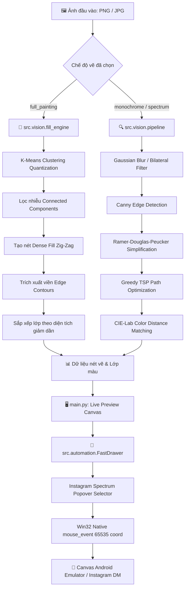

# 📚 AutoDoodle Pro - Tài Liệu Kỹ Thuật & Mã Nguồn

Chào mừng bạn đến với bộ tài liệu kỹ thuật chi tiết của hệ thống **AutoDoodle Pro** — ứng dụng tự động hóa vẽ phác thảo vector và tái tạo tranh sơn dầu/màu đa lớp thời gian thực trên giao diện vẽ của Instagram Direct Message (hoặc các ứng dụng canvas chạy trên trình giả lập Android).

---

## 🗺️ Mục Lục Tài Liệu (Documentation Index)

| Tài liệu | Mô tả nội dung | Phân hệ tương ứng |
| :--- | :--- | :--- |
| 🏗️ [1. Kiến trúc hệ thống (architecture.md)](file:///d:/AutoDoodle/docs/architecture.md) | Tổng quan kiến trúc đa tầng, luồng dữ liệu, hệ tọa độ chuẩn hóa, mô hình đa luồng và hệ thống hiệu chuẩn. | Toàn hệ thống |
| 📦 [2. Phân hệ Core Models (modules/core.md)](file:///d:/AutoDoodle/docs/modules/core.md) | Cấu trúc dữ liệu tĩnh (`TypedDict`, `RGBColor`, `ContourPoints`), bảng màu mặc định Instagram DM và enum chế độ `SpectrumPage`. | `src/core/` |
| 🧠 [3. Phân hệ Thị Giác Máy Tính (modules/vision.md)](file:///d:/AutoDoodle/docs/modules/vision.md) | K-Means quantization, bộ lọc Canny/Bilateral/Adaptive, RDP simplification, Greedy TSP optimization, Zig-Zag scanline fill. | `src/vision/` |
| ⚡ [4. Phân hệ Tự Động Hóa (modules/automation.md)](file:///d:/AutoDoodle/docs/modules/automation.md) | Driver chuột Win32 Native API (120+ FPS), điều hướng dải màu Instagram Popover 3 trang và động cơ thực thi `FastDrawer`. | `src/automation/` |
| 🖥️ [5. Giao Diện Người Dùng (modules/main_gui.md)](file:///d:/AutoDoodle/docs/modules/main_gui.md) | Kiến trúc giao diện Tkinter/ttkbootstrap, cơ chế Live Preview Debounce, Template Matching và Console Stream Redirector. | `main.py` |
| ⚙️ [6. Hướng dẫn Cấu Hình (configuration.md)](file:///d:/AutoDoodle/docs/configuration.md) | Giải thích chi tiết toàn bộ các trường trong `config.json`, các profile cài đặt mẫu và mẹo tinh chỉnh hiệu năng. | Cấu hình bot |

---

## ⚡ Tổng Quan Luồng Xử Lý (High-Level Data Pipeline)



---

## 📂 Tổ Chức Thư Mục Mã Nguồn

```text
AutoDoodle/
├── 📁 assets/                          # Tài nguyên đồ họa & UI tĩnh
│   ├── 📁 icons/                       # Icon ứng dụng & template matching
│   │   ├── icon.ico                    # App Window Icon
│   │   ├── draw_button.png             # Template phát hiện nút vẽ
│   │   ├── plus_icon.png               # Template phát hiện dấu cộng (+)
│   │   ├── thickness_slider_handle.png # Template thanh trượt độ dày cọ
│   │   └── thickness_slider_handle_alt.png
│   └── 📁 samples/                     # Ảnh mẫu phục vụ thử nghiệm
│       └── Lily.png
│
├── 📁 docs/                            # Toàn bộ tài liệu kỹ thuật chi tiết
│   ├── 📁 modules/                     # Tài liệu chuyên sâu cho từng phân hệ
│   │   ├── automation.md               # Win32 driver, spectrum navigator, FastDrawer
│   │   ├── core.md                     # Data models, types, constants
│   │   ├── main_gui.md                 # Tkinter GUI, calibration & queues
│   │   └── vision.md                   # Vision, quantization, RDP, TSP, fill engine
│   ├── architecture.md                 # Kiến trúc hệ thống tổng quan & luồng dữ liệu
│   ├── configuration.md                # Cấu hình config.json và preset
│   └── index.md                        # Trang chủ tài liệu
│
├── 📁 src/                             # Mã nguồn phân hệ cốt lõi
│   ├── __init__.py                     # Package top-level exports
│   ├── 📁 core/                        # Data models, types & shared constants
│   │   ├── __init__.py
│   │   ├── constants.py                # Bảng màu Instagram DM, Enum SpectrumPage
│   │   └── models.py                   # TypedDicts (Point2D, ContourPoints, LayerInfo, ...)
│   ├── 📁 vision/                      # Computer vision & image processing algorithms
│   │   ├── __init__.py
│   │   ├── color_matcher.py            # CIE-Lab Delta-E color distance & sampling
│   │   ├── edge_detector.py            # Canny, Bilateral & Adaptive edge extraction
│   │   ├── fill_engine.py              # Dense zig-zag scanline region filler
│   │   ├── optimizer.py                # Greedy TSP stroke sequencing optimizer
│   │   ├── pipeline.py                 # High-level sketch extraction pipeline
│   │   ├── quantizer.py                # K-Means color quantization & white masking
│   │   └── simplifier.py               # Ramer-Douglas-Peucker (RDP) contour reduction
│   └── 📁 automation/                  # Hardware automation & OS mouse control
│       ├── __init__.py
│       ├── input_driver.py             # Fast Win32 mouse_event / PyAutoGUI driver
│       ├── spectrum_navigator.py       # Instagram 3-Page gradient spectrum mapper
│       └── stroke_executor.py          # FastDrawer canvas stroke execution engine
│
├── 📁 tests/                           # 19 script thử nghiệm, phân tích màu và unit test
│   ├── __init__.py
│   ├── list_preview_colors.py
│   ├── test_mapping.py
│   └── ...
│
├── 📁 outputs/                         # Ảnh kết xuất tạm thời, render test (được gitignore)
│   ├── preview_quantized.png
│   └── sketch_*.png
│
├── main.py                             # Điểm khởi chạy giao diện GUI chính
├── pyproject.toml                      # Cấu hình gói và phụ thuộc (uv package manager)
├── config.json                         # File cấu hình hoạt động của bot
├── requirements.txt                    # Danh sách thư viện Python phụ thuộc fallback
├── .gitignore                          # Cấu hình bỏ qua outputs/, cache, file rác
└── README.md                           # Tài liệu tổng quan dự án
```
