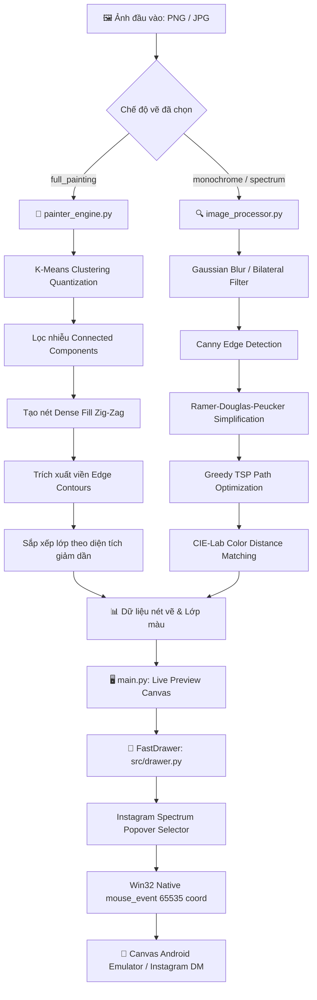

# 📚 AutoDoodle Pro - Tài Liệu Kỹ Thuật & Mã Nguồn

Chào mừng bạn đến với bộ tài liệu kỹ thuật chi tiết của hệ thống **AutoDoodle Pro** — ứng dụng tự động hóa vẽ phác thảo vector và tái tạo tranh sơn dầu/màu đa lớp thời gian thực trên giao diện vẽ của Instagram Direct Message (hoặc các ứng dụng canvas chạy trên trình giả lập Android).

---

## 🗺️ Mục Lục Tài Liệu (Documentation Index)

| Tài liệu | Mô tả nội dung | Đối tượng / Mục đích |
| :--- | :--- | :--- |
| 🏗️ [1. Kiến trúc hệ thống (architecture.md)](file:///d:/AutoDoodle/docs/architecture.md) | Tổng quan kiến trúc đa tầng, luồng dữ liệu, hệ tọa độ chuẩn hóa, mô hình đa luồng và hệ thống hiệu chuẩn. | Nắm bắt toàn bộ luồng hoạt động của app |
| 🎨 [2. Module Painter Engine (painter_engine.md)](file:///d:/AutoDoodle/docs/modules/painter_engine.md) | Phân tích K-Means clustering, thuật toán lọc thành phần liên thông, thuật toán quét nét Dense Zig-Zag Fill và tái tạo lớp màu. | Xử lý tái tạo ảnh màu đa lớp |
| 🔍 [3. Module Image Processor (image_processor.md)](file:///d:/AutoDoodle/docs/modules/image_processor.md) | Phân tích Canny Edge, Ramer-Douglas-Peucker (RDP), giải thuật tối ưu hóa đường đi Greedy TSP và ánh xạ màu CIE-Lab. | Xử lý ảnh phác thảo vector & đường viền |
| 🖱️ [4. Module Fast Drawer (drawer.md)](file:///d:/AutoDoodle/docs/modules/drawer.md) | Trình điều khiển chuột Win32 Native API, cơ chế giải mã dải màu Instagram Popover Spectrum, tự động vuốt trang và xử lý ngắt. | Giao tiếp phần cứng & tự động hóa nét vẽ |
| 🖥️ [5. Module GUI & Điều Phối (main_gui.md)](file:///d:/AutoDoodle/docs/modules/main_gui.md) | Kiến trúc giao diện Tkinter/ttkbootstrap, cơ chế Live Preview Debounce, Template Matching và Console Stream Redirector. | Giao diện điều khiển & trải nghiệm người dùng |
| ⚙️ [6. Hướng dẫn Cấu Hình (configuration.md)](file:///d:/AutoDoodle/docs/configuration.md) | Giải thích chi tiết toàn bộ các trường trong `config.json`, các profile cài đặt mẫu và mẹo tinh chỉnh hiệu năng. | Tùy biến và cấu hình bot |

---

## ⚡ Tổng Quan Luồng Xử Lý (High-Level Data Pipeline)



---

## 📂 Tổ Chức Thư Mục Mã Nguồn

```text
AutoDoodle/
├── 📁 assets/                          # Tài nguyên đồ họa & UI tĩnh
│   ├── 📁 icons/                       # Icon ứng dụng & template matching
│   │   ├── icon.ico                    # App Window Icon
│   │   ├── draw_button.png             # Template phát hiện nút vẽ
│   │   ├── plus_icon.png               # Template phát hiện dấu cộng (+)
│   │   ├── thickness_slider_handle.png # Template thanh trượt độ dày cọ
│   │   └── thickness_slider_handle_alt.png
│   └── 📁 samples/                     # Ảnh mẫu phục vụ thử nghiệm
│       └── Lily.png
│
├── 📁 docs/                            # Toàn bộ tài liệu kỹ thuật chi tiết
│   ├── 📁 modules/                     # Tài liệu chuyên sâu cho từng module
│   │   ├── drawer.md
│   │   ├── image_processor.md
│   │   ├── main_gui.md
│   │   └── painter_engine.md
│   ├── architecture.md
│   ├── configuration.md
│   └── index.md
│
├── 📁 src/                             # Mã nguồn module cốt lõi
│   ├── __init__.py
│   ├── drawer.py                       # Win32 Native Mouse Controller & Palette Navigator
│   ├── image_processor.py              # Edge Detection, RDP & Contour TSP Optimizer
│   └── painter_engine.py               # K-Means Quantization & Multi-layer Painting Engine
│
├── 📁 tests/                           # 19 script thử nghiệm, phân tích màu và unit test
│   ├── __init__.py
│   ├── list_preview_colors.py
│   ├── test_mapping.py
│   └── ...
│
├── 📁 outputs/                         # Ảnh kết xuất tạm thời, render test (được gitignore)
│   ├── preview_quantized.png
│   └── sketch_*.png
│
├── main.py                             # Điểm khởi chạy giao diện GUI chính
├── config.json                         # File cấu hình hoạt động của bot
├── requirements.txt                    # Danh sách thư viện Python phụ thuộc
├── .gitignore                          # Cấu hình bỏ qua outputs/, cache, file rác
└── README.md                           # Tài liệu tổng quan dự án
```
