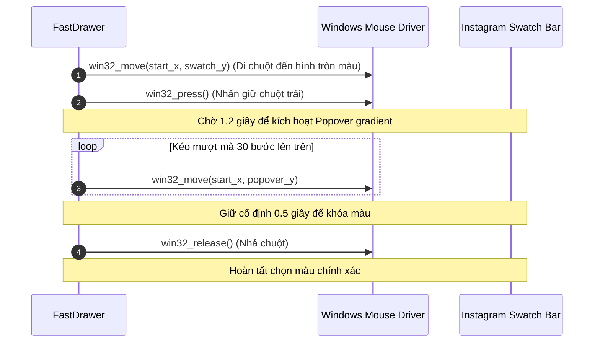
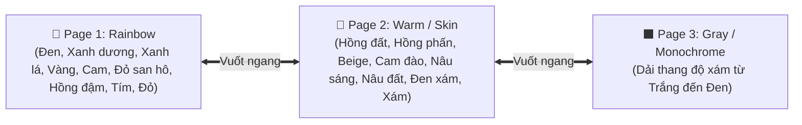

# 🖱️ Module `drawer.py` - Trình Điều Khiển Chuột Win32 & Điều Hướng Bảng Màu Instagram

Module [src/drawer.py](file:///d:/AutoDoodle/src/drawer.py) là thành phần thực thi cấp thấp (Hardware Automation Engine), phụ trách điều khiển chuột Windows ở tốc độ phần cứng (120+ FPS) và giải mã không gian dải màu Popover của Instagram Direct Message.

---

## 1. So Sánh Hiệu Năng: Win32 Direct API vs PyAutoGUI

| Tiêu chí | PyAutoGUI thông thường | Win32 Native API (`FastDrawer`) |
| :--- | :--- | :--- |
| **Cơ chế thực thi** | Gọi qua lớp bọc Python + sleep mặc định $0.1\text{s}$ | Gọi trực tiếp Windows C-Runtime `user32.mouse_event` |
| **Độ trễ mỗi điểm** | $10\text{ms} - 50\text{ms}$ | **$0.1\text{ms} - 2\text{ms}$** (nhanh hơn gấp $50$ lần) |
| **Tốc độ khung hình (FPS)** | ~15-20 FPS (gây giật, đứt nét trên giả lập) | **120+ FPS** (mượt mà như vẽ tay bằng bút Wacom) |
| **Xử lý DPI Scaling** | Dễ bị lệch tọa độ trên màn hình 2K/4K | Chuẩn hóa tọa độ tuyệt đối $[0, 65535]$ chính xác từng pixel |

```python
if IS_WINDOWS:
    import ctypes
    user32 = ctypes.windll.user32
    SCREEN_W = user32.GetSystemMetrics(0)
    SCREEN_H = user32.GetSystemMetrics(1)

    def win32_move(x, y):
        nx = int(x * 65535 / SCREEN_W)
        ny = int(y * 65535 / SCREEN_H)
        user32.mouse_event(0x8001, nx, ny, 0, 0) # MOUSEEVENTF_MOVE | MOUSEEVENTF_ABSOLUTE

    def win32_press():
        user32.mouse_event(0x0002, 0, 0, 0, 0)   # MOUSEEVENTF_LEFTDOWN

    def win32_release():
        user32.mouse_event(0x0004, 0, 0, 0, 0)   # MOUSEEVENTF_LEFTUP
```

---

## 2. Cơ Chế Giải Mã Dải Màu Instagram Spectrum Popover

Dải màu của Instagram DM không phải là một bảng màu tĩnh đơn giản mà có cấu trúc tương tác 2 tầng:

```
[ Giao diện Popover Dải màu Gradient thẳng đứng (Y: 0.0 -> 1.0) ]
  ↑  (Vuốt kéo lên trên sau khi nhấn giữ 1.2s)
[ Hàng Swatch Tròn 9 màu cơ sở (X: 0.0 -> 1.0, swatch_y) ]
```

### 2.1. Quy Trình Chọn Màu Tự Động (`select_color_spectrum`)


---

## 3. Hệ Thống Ánh Xạ Màu Sắc 3 Trang (Spectrum Pages)

Instagram DM phân chia toàn bộ không gian màu thành **3 Trang Swatch (Pages)**:



### 3.1. Trang 1 (Rainbow) - Hàm `rainbow_spectrum_pct(rgb)`
Ánh xạ góc Hue $(0^\circ - 360^\circ)$ từng đoạn tuyến tính (Piecewise Linear) vào 9 vị trí swatch cơ sở:

| Swatch X% | Tên Swatch cơ sở | Dải Hue tương ứng | Xử lý đặc biệt |
| :--- | :--- | :--- | :--- |
| `0.000` | #1 Đen (Black) | Độ bão hòa $S < 0.10$ | Dùng độ sáng Luma điều chỉnh Y |
| `0.125` | #2 Xanh dương (Blue) | $180^\circ - 240^\circ$ | Nét bóng lạnh |
| `0.250` | #3 Xanh lá (Green) | $60^\circ - 120^\circ$ | Nhụy hoa / Lá xanh $(x=0.295, y=0.15)$ |
| `0.375` | #4 Vàng (Yellow) | $45^\circ - 60^\circ$ | Ánh nắng / Tông vàng |
| `0.500` | #5 Cam (Orange) | $30^\circ - 45^\circ$ | Da ấm / Cam san hô |
| `0.625` | #6 Đỏ san hô (Coral) | $10^\circ - 30^\circ$ | Cánh hoa tươi |
| `0.750` | #7 Hồng đậm (Magenta) | $330^\circ - 360^\circ$ | Cánh hoa Lily / Đỏ hồng |
| `0.875` | #8 Tím (Purple) | $260^\circ - 300^\circ$ | Tím lavender |
| `1.000` | #9 Đỏ tươi (Red) | $0^\circ - 10^\circ$ | Đốm thẫm / Maroon $(x=0.960, y=0.20)$ |

### 3.2. Trang 2 (Warm / Nude) - Hàm `warm_spectrum_pct(rgb)`
Tối ưu hóa đặc biệt cho tranh hoa lá, chân dung người, màu pastel dịu nhẹ:
- Hồng đất, Hồng phấn, Da người, Mauve, Beige.
- Kéo cao trục $Y$ ($y = 0.45 \dots 0.75$) để tạo hiệu ứng màu phấn mờ siêu thực.

### 3.3. Chế Độ Hybrid Mode (Page 4 - Tự Động Vuốt Chuyển Trang)
Hàm `choose_best_page_for_color(rgb)` tự động phân tích từng lớp màu:
- Các lớp cánh hoa mềm pastel $\to$ Vuốt sang **Page 2 (Warm)**.
- Các lớp nhụy xanh, cuống lá, đốm đậm $\to$ Vuốt sang **Page 1 (Rainbow)**.
- Khi cần đổi trang, hàm `swipe_spectrum_page(...)` tự động thực hiện thao tác vuốt trượt ngang trên thanh swatch để lật trang tức thì!

---

## 4. Xử Lý Nét Vẽ & Ngắt Khẩn Cấp

### 4.1. Thuật Toán Di Chuột Mịn (`smooth_drag_to`)
Nội suy tuyến tính theo khoảng cách Euclid để tránh hiện tượng chuột nhảy bước làm đứt nét vẽ trên Canvas:
```python
if dist > self.step_size:
    steps = int(dist / self.step_size)
    for s in range(1, steps + 1):
        ix = int(curr_x + (dx * s / steps))
        iy = int(curr_y + (dy * s / steps))
        win32_move(ix, iy)
        time.sleep(delay)
```

### 4.2. Phím Nóng Toàn Cục (`check_stop_and_pause`)
- Nhấn **`SPACE`**: Tạm dừng bot ngay lập tức để người dùng chỉnh sửa hoặc đổi nét cọ. Nhấn lại `SPACE` để tiếp tục vẽ từ điểm dừng.
- Nhấn **`Q`**: Ngắt khẩn cấp ngay lập tức, giải phóng toàn bộ nút chuột (`win32_release()`), bảo vệ an toàn cho hệ điều hành.
