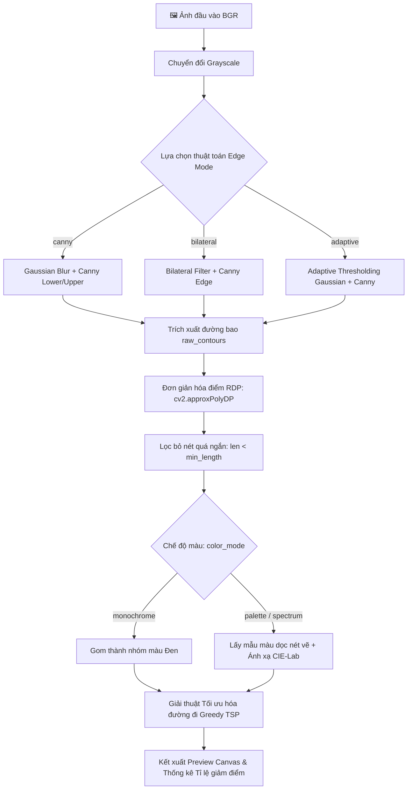

# 🔍 Module `image_processor.py` - Xử Lý Ảnh Phác Thảo & Đường Viền Vector

Module [src/image_processor.py](file:///d:/AutoDoodle/src/image_processor.py) phụ trách các thuật toán thị giác máy tính (Computer Vision) để trích xuất đường viền (edges), đơn giản hóa nét vẽ (simplification), tối ưu thứ tự di chuyển bút (TSP optimization) và phân loại màu sắc theo cảm nhận thị giác người (CIE-Lab color matching).

---

## 1. Quy Trình Trích Xuất & Tối Ưu Nét Phác Thảo



---

## 2. Chi Tiết Các Thuật Toán Cốt Lõi

### 2.1. Không Gian Màu CIE-Lab & Đo Khoảng Cách Cảm Nhận Thị Giác
Trong không gian RGB thông thường, khoảng cách Euclid không phản ánh đúng sự khác biệt màu sắc mà mắt người cảm nhận (ví dụ hai sắc độ xanh lá có thể có khoảng cách RGB lớn nhưng mắt nhìn thấy gần như tương đương). Do đó, hệ thống chuyển đổi sang không gian **CIE-Lab**:

$$L^* \text{ (Độ sáng)}, \quad a^* \text{ (Trục Đỏ - Xanh lá)}, \quad b^* \text{ (Trục Vàng - Xanh dương)}$$

```python
def rgb_to_lab(rgb_color):
    bgr_pixel = np.uint8([[[rgb_color[2], rgb_color[1], rgb_color[0]]]])
    lab_pixel = cv2.cvtColor(bgr_pixel, cv2.COLOR_BGR2LAB)
    return lab_pixel[0][0].astype(np.float32)

def color_distance_lab(rgb1, rgb2):
    lab1 = rgb_to_lab(rgb1)
    lab2 = rgb_to_lab(rgb2)
    return np.linalg.norm(lab1 - lab2)
```

- Áp dụng khi chọn màu gần nhất trong `INSTAGRAM_DEFAULT_PALETTE` 9 màu mặc định của Instagram.

---

### 2.2. Thuật Toán Đơn Giản Hóa Ramer-Douglas-Peucker (RDP)
Khi trích xuất viền từ ảnh số, số lượng điểm ảnh dọc viền rất lớn ($10.000 - 50.000$ điểm), khiến tốc độ vẽ bị chậm và nét vẽ bị giật:

$$\text{RDP Algorithm}: \quad \text{approx} = \operatorname{approxPolyDP}(\text{contour}, \epsilon, \text{closed}=\text{False})$$

- Tham số $\epsilon$ (Epsilon): Ngưỡng dung sai khoảng cách vuông góc tối đa.
  - $\epsilon = 0.3 \dots 0.5$: Độ chi tiết cực cao cho tranh nghệ thuật.
  - $\epsilon = 1.0 \dots 2.0$: Nét vẽ tốc độ cao, giảm $70\% - 90\%$ số điểm mà vẫn giữ nguyên đường nét đặc trưng của chủ thể.

---

### 2.3. Giải Thuật Tối Ưu Thứ Tự Đường Đi (Greedy TSP Path Optimizer)
Bài toán tối ưu hóa nét vẽ là biến thể của **Traveling Salesperson Problem (TSP)**: Tìm thứ tự vẽ các contour sao cho khoảng cách di chuyển chuột khi nhấc bút (pen-up distance) là nhỏ nhất.

- **Hàm `sort_contours_greedy(contours)`**:
  1. Bắt đầu từ contour đầu tiên.
  2. Tại điểm cuối của contour hiện tại $P_{\text{last}}$, tìm trong tập contour chưa thăm nét có điểm đầu $P_{\text{start}}$ hoặc điểm cuối $P_{\text{end}}$ gần $P_{\text{last}}$ nhất:
     $$d_{\text{min}} = \min_{i} \left( \| P_{\text{last}} - P_{\text{start}}^{(i)} \|, \| P_{\text{last}} - P_{\text{end}}^{(i)} \| \right)$$
  3. Nếu $P_{\text{end}}^{(i)}$ gần hơn, tự động **đảo ngược chiều nét vẽ** (`next_cnt = next_cnt[::-1]`).
  4. Lặp lại cho đến khi duyệt hết toàn bộ nét vẽ.

> [!TIP]
> Thuật toán Greedy TSP giúp rút ngắn tới **$60\%$ tổng thời gian di chuyển bút pen-up** và triệt tiêu hiện tượng đầu bút bay nhảy loạn xạ trên màn hình.

---

### 2.4. Trích Xuất Màu Trung Bình Dọc Nét Vẽ (`sample_contour_color`)
Với mỗi contour, hàm lấy mẫu màu từ ảnh gốc tại các vị trí cách đều nhau dọc theo đường nét:
```python
def sample_contour_color(image_bgr, contour):
    step = max(1, len(contour) // 20)
    for i in range(0, len(contour), step):
        pt = contour[i]
        ...
```
Sau đó tính trung bình cộng $(R_{\text{avg}}, G_{\text{avg}}, B_{\text{avg}})$ để gán màu đại diện chuẩn xác nhất cho toàn bộ nét vẽ đó.
